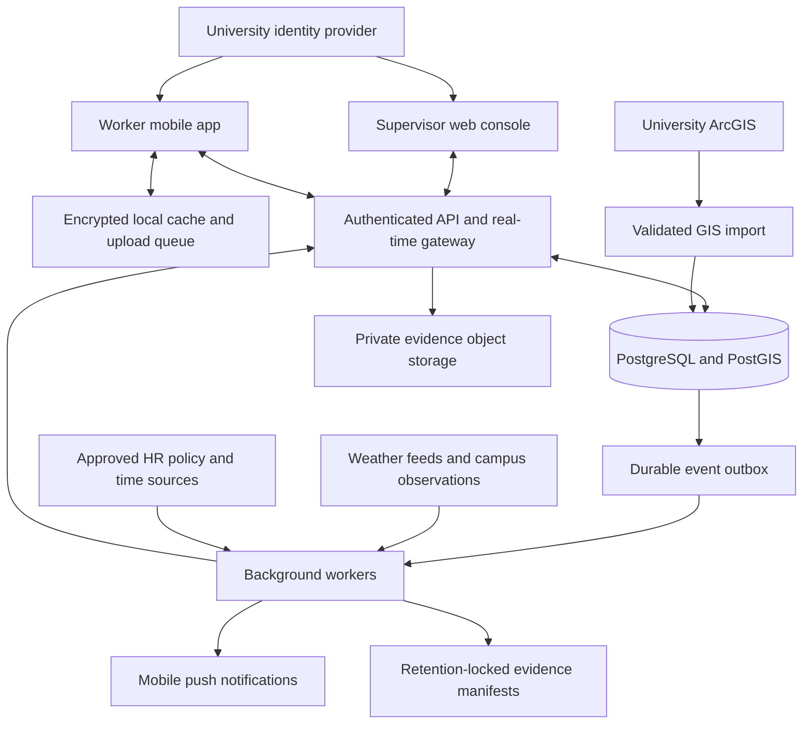
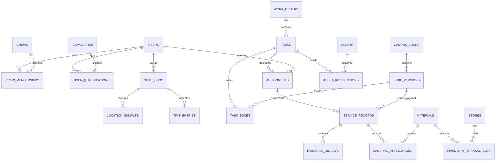

# UND Grounds Operations: technical blueprint

Version 0.2 | September 6, 2026 | Proposed architecture, not an implemented system

## 1. Architectural decision

Build one internal operations platform with seasonal operating profiles. Use a modular backend, a browser-based supervisor console, and a mobile worker application backed by PostgreSQL/PostGIS. Share identities, assets, crews, work orders, evidence, and labor records across both seasons. No invoicing, external billing, CRM, or sales modules.

Primary outcome: a worker arriving mid-day sees an eligible next assignment, assigned equipment, directions, hazards, and completion requirements. Supervisors delegate outcomes and redistribute unfinished work with a coverage preview.

Recommended implementation stack: TypeScript with React for the supervisor console; React Native with platform-specific location services for mobile; a TypeScript/NestJS modular backend exposing REST and WebSocket interfaces; PostgreSQL/PostGIS; private versioned object storage with retention locking; and a background worker driven by a transactional outbox. These are proposed engineering choices, subject to university IT hosting and identity standards. Start with a modular monolith, not separately deployed microservices.

The existing single-file Leaflet app remains a map prototype and data source. Its AGENTS.md prohibits converting that file to a framework app. Build the operational application in a separate package/repository after coordinating with Claude; import verified data through a migration tool. Do not overwrite its active checkout or manufacture operational coordinates from placeholders.

## 2. High-level architecture

One API deployment and worker deployment initially share domain code and database migrations. Scale the real-time gateway or telemetry ingestion separately only when measurements justify it. Redis may later support connection fan-out and short-lived caching; it is not the authoritative assignment store.

Authentication uses the university identity provider through OIDC authorization code flow, with PKCE for mobile. Web sessions use secure, HttpOnly cookies and CSRF protection where applicable. Mobile secrets use platform secure storage. Every operation checks role, department, crew scope, and current assignment access on the server. Database row-level security adds defense in depth; privileged maintenance accounts are separate from application connections. PostgreSQL notes that owners and bypass roles can evade ordinary row policies, so test using the real runtime role [S1].

## 3. Modules and boundaries

| Module | Owns | Main behavior |
|---|---|---|
| Identity and organization | People, reporting lines, crews, scoped roles | Chad sees all crews; leads delegate only within their crew; leadership gets workload oversight |
| Qualifications | Certifications, restrictions, verification history | Check capability and expiration independently of Temp 1/Temp 2 |
| Seasonal operations | Mode revisions, policies, storm events | Publish a consistent operating profile |
| GIS and knowledge | Zone versions, routes, hazards, utility assets | Import, validate, map, and retain historical geometry |
| Dispatch | Work orders, tasks, reservations, assignment revisions | Match qualified labor and available equipment; handle overrides |
| Telemetry | Shift-bound location samples and device status | Show last known location, accuracy, and staleness |
| Service evidence | Service attempts, photos, location assessments, corrections | Preserve provenance and completeness |
| Fleet | Equipment, attachments, meter readings, maintenance | Prevent unavailable equipment dispatch and schedule maintenance |
| Materials | Stores, units, inventory ledger, applications | Track salt, brine, fuel, fertilizer, and adjustments |
| Labor and policies | Time intervals, policy evaluations, alerts | Internal labor allocation and policy checks |
| Integrations and reporting | ArcGIS/weather/HR adapters and exports | Isolate external dependencies from core work |

Bobby and Mason receive proposed management roles, but exact scopes remain an explicit configuration decision. Leadership sees backlog, blockers, staffing, and coverage rather than a GPS-derived performance ranking. Certification verification is a separate permission from dispatch.

## 4. Seasonal pivot protocol

Store an authoritative campus-level `operating_state`: mode SUMMER/WINTER, monotonically increasing revision, effective time, actor, reason, and active storm ID where applicable. Tasks retain their own season; changing mode changes the operating defaults and priorities, not historical records.

1. An authorized supervisor requests a pivot with `expected_revision` and an idempotency key.
2. The server locks the operating-state row, checks the revision, and computes a preview of newly prioritized queues, equipment conflicts, and summer tasks needing attention.
3. Confirmation commits the new state, an immutable change event, and an outbox event in one database transaction.
4. A worker broadcasts `OperatingModeChanged` to connected authorized clients. Each client loads a mode snapshot at that revision and swaps navigation, map styles, checklists, and dispatch defaults together.
5. Clients acknowledge the revision; the console shows lagging/offline devices. Reconnection retrieves the authoritative snapshot and missed assignment events.
6. Existing work remains assigned, paused by an explicit action, or reassigned after a preview. Emergency work is visible across seasons. Returning to summer is a new recorded transition, not deletion of the winter event.

Online design target: 95% of connected clients reflect the change within five seconds under pilot load. This is a proposed acceptance target, not an instantaneous guarantee. Offline clients retain cached assignments with a prominent stale-mode indicator. Submissions carry their observed revision; a mode change alone does not discard completed work, while a superseded assignment enters reconciliation.

Summer profile: turf, trees, inspections, landscape projects, irrigation. Winter profile: active storm, route coverage, ice treatments, critical access, reinspection. Profiles contain queue rules, overlay visibility, labels, and checklist versions; avoid scattering season-specific conditionals throughout the code.

Priority policy is versioned. Support P1/P2/P3 in both profiles plus the existing winter T4/by-request state. Existing project targets are T1 6:30 a.m., T2 7:30 a.m., T3 noon next day, T4 by request; verify the underlying standard and what event starts each deadline before implementing it. Do not silently translate these into different deadlines.

## 5. GIS, routes, and campus knowledge

Use stable zone IDs and immutable geometry revisions. Operational areas use `geometry(MultiPolygon,4326)`; routes use ordered LineString segments; points represent hazards, valves, sprinkler heads, and fixed assets. ADA status is an explicit attribute, not inferred from polygon color. Include pedestrian plazas, roads, commuter lots, turf areas, and hand-work zones.

ArcGIS import records service/layer ID, source feature ID, source spatial reference, retrieved time, source revision, and import validation results. Explicitly request/transform coordinates to the selected storage reference; ArcGIS query APIs support output spatial references [S2]. Preserve authoritative acreage separately from calculated geometry area. Calculate distances and areas with geography or an approved projected coordinate system, not degrees.

Validate geometry, coordinate order, duplicates, holes, and intended overlaps. Maintain GiST spatial indexes. Import updates create new zone versions; evidence and route assignments remain linked to the versions used at the time. Start with one-way imports from university GIS, with proposed corrections reviewed before publication.

Use both labels/patterns and colors for priority. Keep map base layers distinct from operational overlays. Cache only imagery/maps permitted for offline use. Snow navigation needs a validated network with direction, width, machine/attachment compatibility, hazards, and ordered steps; polygons alone cannot provide turn guidance.

Utilities carry source, confidence, owner, and last verification. Drone imagery can improve surface mapping but does not verify buried infrastructure.

## 6. Dispatch, location, and weather automation

An eligible assignment requires valid qualifications for the task and equipment/attachment combination, an appropriate shift, compatible equipment, and permitted crew scope. Skill preferences rank eligible candidates without overriding hard requirements. Cross-crew changes require supervisor authority. Equipment and employee schedule conflicts are checked transactionally.

Reassignment creates a new assignment revision, preserves completed segments and evidence, transfers remaining work, releases/rebooks equipment, and notifies both workers. A dispatcher previews displaced work and tasks lacking a replacement. Overrides are versioned commands requiring acknowledgment, not an assumption that push delivery means acceptance. Escalate unacknowledged critical instructions through the department's established communication procedure.

Mobile tracking begins with an active shift and visible tracking state, and stops at shift end. Proposed pilot sampling: every 15-30 seconds while moving, slower when stationary; tune on real phones for accuracy and battery. Upload batches with device/sample IDs and captured timestamps; retain server receipt times. Show a marker as stale after a configurable threshold, initially 90 seconds. Background permissions and operating-system scheduling can reduce updates; Android documents background location limits [S3]. A web pilot uses HTTPS and explicit geolocation permission [S4], but foreground browser tracking does not fulfill reliable screen-locked tracking.

Reject invalid coordinates, flag implausible jumps, and exclude off-shift capture from ordinary ingestion. Late uploads captured within a valid shift may still be accepted. Telemetry is not a timecard and does not prove work occurred.

Weather rules store source, field, units, observation versus forecast, time window, threshold, freshness, confidence, cooldown, and reset condition. The following are examples from the request, not adopted UND policy:

| Condition | Suggested action |
|---|---|
| Trace precipitation plus approved ice-risk criteria | Prepare treatment crew dispatch |
| Verified storm accumulation at or above 2 inches | Prepare full plow fleet call-out |
| Stale/conflicting weather input | Flag supervisor review; do not interpret as zero snow |

Use storm-total accumulation over a defined window, not repeated summation of cumulative readings. NWS provides forecasts, alerts, and observations [S5]; confirm that selected feeds actually contain suitable local accumulation or add verified campus measurements. Evaluate rules against stored input snapshots. Key each activation by storm, rule version, group, and activation cycle to suppress duplicates. Begin with supervisor approval; enable automatic call-outs only after policy validation. Manual override always records actor/reason. Hysteresis and cooldown prevent repeated dispatch as measurements oscillate.

## 7. Service evidence and record integrity

Model completion as a service attempt followed by validation and finalization. Required winter fields: task/assignment revision, worker and shift, zone version, captured and received timestamps, location sample and accuracy, material quantities or explicit zero/no-application reason, and before/after originals. Checklists define requirements for each activity and season.

1. Capture a before photo and start context before work; preserve originals and capture metadata.
2. Record application quantity, unit, material lot/store where known, and measurement method such as calibrated spreader versus estimate.
3. Capture after photo and fresh position; queue locally during outages with stable UUIDs.
4. Upload through short-lived private upload authorization. Verify checksum, size, media type, and scan status; associate immutable object version IDs.
5. Server assesses the sample against the exact zone revision. `ST_Covers` includes polygon boundaries [S6]. Combine this with reported accuracy, sample age, and distance: classify inside, outside, ambiguous, or unavailable. A point inside a narrow walkway with a large accuracy radius is ambiguous, not verified clearance.
6. Finalize only when the evidence policy passes. Missing or ambiguous evidence produces an exception with reason and supervisor review; never fabricate a GPS fix or a before photo. Physical service can be recorded as performed while evidence remains incomplete.
7. Publish the canonical evidence manifest and originals to retention-locked storage. Mark archival state pending until object versions and lock status are verified, then archived. Retry safely after failures.

Device timestamps and GPS are evidence inputs, not trusted proof of presence. Keep server receipt time separately; clock drift, delayed sync, and mock-location flags are visible in reports. Photos and geometry checks cannot guarantee that the entire zone was cleared.

Use append-only evidence events, restricted database permissions, canonical payload hashes, per-record event sequence/hash chains, and signed manifest digests. Store signed digests outside ordinary database administrator control. Database hashes alone cannot prevent an administrator from rewriting the entire chain. Retention-locked object versions provide a separate control; S3 Object Lock compliance mode prevents alteration/deletion of a protected version during retention, including by account root [S7]. Provider selection remains open.

Corrections append a superseding event with reason and reviewer; they do not overwrite originals. A forensic export includes original media references/hashes, geometry version, task history, weather source/time, material measurement methods, location uncertainty, corrections, archive verification, and access/export audit. Do not call the output a liability guarantee. University records staff and counsel must define retention, legal hold, and report use before production; no local legal rule or retention period is assumed here.

## 8. Relational schema

All business IDs are UUIDs unless noted. `PK` denotes primary key; `FK` denotes foreign key. Mutable records have `created_at`, `updated_at`, and integer `version`; recorded events use `recorded_at` and append-only changes. Store timestamps as `timestamptz` in UTC and evaluate institutional workweeks in America/Chicago, including daylight-saving transitions. Use fixed-precision numeric quantities and explicit units.

| Table | Key fields and relationships |
|---|---|
| campuses | id PK, name, timezone |
| users | id PK, campus_id FK, identity_subject UNIQUE, display_name, employment_tier, active |
| reporting_relationships | id PK, user_id FK, manager_id FK users, valid_from/to; prevent self/cyclic reporting |
| crews / crew_memberships | crews(id PK, campus_id FK, lead_user_id FK); memberships(id PK, crew_id FK, user_id FK, valid_from/to) |
| role_grants | id PK, user_id FK, role, campus_id FK, crew_id FK nullable, valid_from/to |
| capabilities / user_qualifications | capabilities(id PK, code UNIQUE); qualifications(id PK, user_id FK, capability_id FK, scope, verified_by FK users, valid_from/to, state, supersedes_id FK) |
| operating_state / mode_events | state(campus_id PK/FK, mode, revision, active_storm_id FK nullable); events(id PK, campus_id FK, revision UNIQUE per campus, mode, actor_id FK, reason, effective_at) |
| priority_policies | id PK, campus_id FK, mode, tier_code, rank, deadline_rule, version, approved_by FK nullable |
| campus_zones | id PK, campus_id FK, stable_code UNIQUE per campus, name, asset_class, responsible_crew_id FK |
| zone_versions | id PK, zone_id FK, version, geom MultiPolygon 4326, source_ref, source_srid, needs_tracing, verified_by FK nullable, effective_at; UNIQUE(zone_id,version) |
| zone_priorities | zone_version_id FK, policy_id FK; composite PK |
| mapped_assets / hazards | id PK, campus_id FK, zone_version_id FK nullable, geom Point 4326, kind, source, confidence, verified_at, state |
| routes / route_versions / route_segments | route(id PK,campus_id FK); version(id PK,route_id FK,version,mode); segment(id PK,route_version_id FK,sequence,geom LineString 4326,zone_version_id FK,width_m,instructions); UNIQUE(route_version_id,sequence) |
| assets | id PK, campus_id FK, stable_code UNIQUE per campus, type, parent_asset_id FK nullable, state, meter_unit |
| asset_capability_requirements | asset_id FK, capability_id FK; composite PK; attachment requirements evaluated with carrier |
| attachment_mounts | id PK, attachment_id FK assets, carrier_id FK assets, mounted_at, removed_at |
| asset_meter_readings | id PK, asset_id FK, reading, unit, observed_at, source, supersedes_id FK nullable |
| maintenance_plans / maintenance_jobs | plan(id PK,asset_id FK,hour_interval,day_interval,baseline_reading_id FK); job(id PK,plan_id FK,asset_id FK,state,completed_at,meter_reading_id FK) |
| work_orders | id PK, campus_id FK, external_reference nullable, title, outcome, requested_by FK, priority_policy_id FK, status |
| tasks | id PK, work_order_id FK, mode, checklist_version_id FK, route_version_id FK nullable, state, version, due_at |
| task_zones / task_requirements | task_zones(task_id FK,zone_version_id FK, composite PK); requirements(task_id FK,capability_id FK, composite PK) |
| assignments | id PK, task_id FK, user_id FK, crew_id FK, accountable_owner boolean, revision, planned_start/end, state, acknowledged_at, supersedes_id FK nullable |
| asset_reservations | id PK, asset_id FK, task_id FK, assignment_id FK nullable, interval tstzrange, state |
| shift_logs | id PK, user_id FK, crew_id FK, started_at, ended_at, status, source |
| location_samples | id UUID, captured_at, received_at, shift_id FK, user_id FK, device_id FK, geom Point 4326, accuracy_m, sequence; partition-aware PK(id,captured_at) |
| devices | id PK, user_id FK, platform, last_seen_at, revoked_at; notification tokens stored securely |
| time_entries | id PK, shift_id FK, task_id FK nullable, zone_version_id FK nullable, interval tstzrange, activity_code, approval_state, supersedes_id FK nullable |
| materials / stores | material(id PK,code UNIQUE,base_unit,dimension); store(id PK,campus_id FK,name) |
| inventory_transactions | id PK, material_id FK, store_id FK, signed_base_quantity, transaction_type, service_record_id FK nullable, transfer_group_id nullable, source_key UNIQUE, observed_at |
| material_applications | id PK, service_record_id FK, material_id FK, store_id FK, quantity, unit, base_quantity, conversion_version, measurement_method |
| checklists / checklist_versions | checklist(id PK,name); version(id PK,checklist_id FK,version,definition,approved_by FK); immutable definitions |
| service_records | id PK, assignment_id FK, shift_id FK, zone_version_id FK, captured_at, received_at, outcome, evidence_status, archive_status, idempotency_key UNIQUE per user |
| service_location_assessments | id PK, service_record_id FK, sample_id and sample_captured_at composite FK, result, distance_m, accuracy_m, algorithm_version |
| evidence_objects | id PK, service_record_id FK, kind BEFORE/AFTER/OTHER, object_key, object_version, sha256, captured_at, uploaded_at, scan_state, retain_until, legal_hold |
| evidence_events | id PK, service_record_id FK, sequence, event_type, canonical_payload, previous_hash, payload_hash, actor_id FK, recorded_at; UNIQUE(service_record_id,sequence) |
| storm_events / weather_observations | storm(id PK,campus_id FK,start/end,status); observation(id PK,storm_id FK nullable,source,source_time,received_at,metric,value,unit,kind,raw_object_ref) |
| dispatch_rules / rule_evaluations | rule(id PK,campus_id FK,version,conditions,callout_group_id FK,approval_mode); evaluation(id PK,rule_id FK,storm_id FK,input_snapshot,result,dedup_key UNIQUE) |
| callout_groups / callout_memberships | group(id PK,campus_id FK,name); membership(group_id FK,user_id FK, composite PK) |
| labor_policy_versions / policy_alerts | policy(id PK,campus_id FK,scope,source,effective_from/to,week_definition,limit,approved_by FK); alert(id PK,policy_id FK,user_id FK,window_start,observed,projected,state) |
| cost_rate_versions | id PK, employment_class or asset_id FK, rate, unit, effective_from/to; restricted internal accounting access |
| notification_deliveries | id PK,recipient_id FK,event_id FK outbox,channel,state,attempts,acknowledged_at; UNIQUE(recipient_id,event_id,channel) |
| outbox_events | id PK,aggregate_type/id,aggregate_version,event_type,payload,created_at,published_at; unique aggregate event revision |
| audit_events | id PK,actor_id FK,action,entity_type/id,request_id,recorded_at,details_hash; capture access and administrative changes |

### Essential database invariants

- Foreign keys use RESTRICT for historical evidence dependencies. Deactivate people/assets instead of cascading deletion of service history.
- Partial uniqueness allows at most one current accountable owner per task; tasks intentionally unassigned appear in a visible queue.
- Exclusion constraints prevent overlapping active equipment reservations. Lock eligible resources during dispatch; application prechecks alone race.
- Prevent overlapping active shifts per employee and overlapping payable time intervals. Multi-person work counts each person's time; zone allocations for one interval must sum to 100% without duplicating paid hours.
- Meter readings cannot decrease without an explicit correction/reset event. Maintenance due at the earlier configured hour or calendar threshold; meter hours are not inferred from GPS presence.
- Inventory balances derive from an append-only ledger. Reservation/issue operations lock the material-store balance projection; atomic transfer pairs sum to zero. Corrections use reversing entries. Do not convert pounds to gallons without an approved material-specific conversion.
- Geometries require valid type/SRID and spatial indexes. Evidence points refer to immutable zone versions.
- Time-series partitions need composite uniqueness compatible with partition keys; retain a separate ingestion dedup record if needed across partitions.
- Qualification validity and policy rules are rechecked in server transactions at dispatch/start, not encoded solely as static SQL checks across mutable tables.

### Core ERD

## 9. API and synchronization contract

REST endpoints: `GET /operations/snapshot`, `POST /operations/pivot`, `GET /zones?bbox=...`, `POST /shifts`, `POST /shifts/{id}/end`, `POST /locations/batch`, `POST /tasks/{id}/assignments`, `POST /assignments/{id}/acknowledge`, `POST /assignments/{id}/reassign`, `POST /service-records`, `POST /evidence/upload-intents`, `POST /service-records/{id}/finalize`, `POST /time-entries`, and `GET /reports/service-history`.

Commands carry idempotency keys and expected entity revision. Responses distinguish accepted, conflicting, pending uploads, and finalized. Use 409 for stale assignment revisions; preserve the submitted field record for reconciliation rather than silently discard it. Upload intents constrain object path, content size/type, and expiry; downloads require authorization and short-lived links.

Real-time events include operating-mode changes, assignment changes, acknowledgment, location freshness, service finalization, and policy alerts. Deliver at least once with deduplication and revision ordering. Reconnect using a durable cursor or retrieve a fresh snapshot when the cursor is too old. Do not put private personnel or location data into broad push notification payloads. Revoke subscriptions when scopes change.

Mobile keeps an encrypted local queue of commands and media, captures client IDs before network submission, retries with backoff, and visibly distinguishes saved locally from synchronized and archived. Flush successful entries only after server confirmation. Offline work is allowed against cached assignments, with conflicts resolved on return. Shift end stops capture even when the server is unavailable.

## 10. Assets, materials, and labor rules

Maintenance plans use approved hour/date intervals and create one open job per due cycle. An out-of-service state blocks new reservations; an authorized operational exception, if permitted by policy, must be explicit and auditable. Low-stock alerts use available balance minus reservations and an approved threshold; deduplicate until replenishment or a materially changed condition.

Record task labor, travel, training, breaks, and blocked time separately using institution-approved earning/activity codes. Split work across zones with explicit intervals or allocation percentages. Material and equipment costs use effective-dated rates and remain internal estimates until reconciled to authoritative finance sources.

Student-hour limits must be configured from approved institutional policy, effective dates, academic calendar, employment category, and the institution's workweek. Do not hardcode a generic limit. If caps cover all campus employment, import other department hours or label evaluations incomplete. Evaluate both posted hours and proposed assignments; warn before the next assignment would exceed a configured threshold. Capture missing-source status rather than asserting compliance. Regional safety rules require the safety office's approved requirements and sources, including training, inspection, and equipment restrictions; this blueprint does not invent them.

## 11. MVP roadmap and release gates

Indicative effort is sequencing guidance, not a delivery commitment. Staffing, device access, GIS quality, and university IT approvals determine schedule.

1. **Foundation and field validation.** Coordinate the GitHub handoff; establish separate working copies. Confirm identity/hosting, permissions, one verified zone, a small crew, equipment qualifications, evidence rules, device mix, and records retention owner. Test background capture on actual phones before committing to the mobile approach. Gate: data and operating decisions documented; no placeholder geography used for verification.
2. **Vertical slice: dispatch to evidence.** Implement identity, crew scope, shifts, one task, qualified assignment, foreground GPS, photo capture, quantity entry, local queue, and supervisor receipt. Gate: two real devices share work; retries produce one record; one worker cannot read another crew's protected data.
3. **MVP mobile tracking.** Add native background capture, shift stop, freshness markers, batched uploads, reconnect cursor, assignment acknowledgment, and override handling. Gate: field test screen lock, battery saver, permission denial, network loss, and shift end; absent updates visibly become stale.
4. **MVP proof-of-service.** Add immutable zone references, accuracy-aware assessments, before/after enforcement, exception review, append-only correction, locked evidence manifests, and a reproducible service report. Gate: attempt object/record tampering, duplicate upload, old GPS, boundary uncertainty, missing photos, and delayed sync; verify retained originals and honest exception reporting.
5. **MVP seasonal pivot and pilot.** Enable summer/winter profiles, event propagation, preserved work, one storm event, and manual winter dispatch. Gate: concurrent pivots resolve deterministically; connected clients meet measured latency target; offline clients reconcile without losing summer work. Pilot one crew/zone before campus rollout.
6. **Operational expansion.** Add fleet maintenance, attachment reservations, inventory ledger, full time allocation, policy alerts, and cross-crew redistribution. Gate: race tests prevent double booking, material transfers balance, and multi-job student-hour data coverage is explicit.
7. **Winter automation and campus scale.** Add validated weather rules, approved automatic call-outs, route guidance, campus GIS imports, utilities, and reinspection. Gate: duplicate/stale weather simulations, documented route validation, and storm exercise with fallback communications.

MVP includes the minimum material application record and qualification checks, but not the complete stock/maintenance/planning suite. Reliable background location, offline evidence, and retained originals are release requirements for the stated operational MVP; a browser demo alone is an earlier prototype.

## 12. Operations, sizing, and verification

Initial sizing assumption: 100 active devices, ten-hour shifts, 15-second sampling means about 240,000 samples/day. Photo storage usually dominates; at 1,000 completions/day with two 3 MB originals, allow roughly 6 GB/day before replicas and backups. Replace these assumptions with pilot measurements before budgeting retention.

Proposed service targets: connected dispatch/pivot visibility p95 under five seconds; explicit stale markers within the configured threshold; successful offline replay without duplicate business effects. Agree recovery objectives with IT before production; a starting design target is database RPO of 15 minutes and RTO of four hours, subject to restore drills. Evidence archival state has its own recovery and reconciliation checks.

Use private networking for database/storage administration, managed secrets, least privilege, encrypted backups, point-in-time recovery, and separate dev/test/production. Test with synthetic personnel and locations. Log event lag, failed uploads, stale devices, acknowledgment delay, storage-lock failures, rule-source staleness, and backup status without copying full location trails into generic diagnostic logs.

Required verification: authorization matrix; concurrent dispatch/reservation/pivot tests; mobile field/battery tests; offline and clock-skew tests; spatial boundary/accuracy tests; evidence hash/retention checks; DST/workweek and overlapping-time tests; inventory unit/transfer tests; weather replay tests; and restore drills. Preserve an operational fallback when the app is down.

## 13. Sources and unresolved decisions

These primary technical sources support platform behavior, not UND policy or legal sufficiency:

- [S1 PostgreSQL row security](https://www.postgresql.org/docs/current/ddl-rowsecurity.html).
- [S2 Esri feature query and spatial reference](https://developers.arcgis.com/rest/services-reference/enterprise/query-feature-service-layer/).
- [S3 Android background location limits](https://developer.android.com/about/versions/oreo/background-location-limits).
- [S4 MDN Geolocation API](https://developer.mozilla.org/en-US/docs/Web/API/Geolocation_API).
- [S5 National Weather Service API](https://www.weather.gov/documentation/services-web-api).
- [S6 PostGIS ST_Covers](https://postgis.net/docs/manual-3.7/en/ST_Covers.html).
- [S7 S3 Object Lock](https://docs.aws.amazon.com/AmazonS3/latest/userguide/object-lock.html).

Resolve with the appropriate owners: university identity/hosting and device management (IT); three versus four priority tiers, route deadlines, call-out rules, and qualification scope (Grounds); hour limits and cross-department time feed (HR/payroll); evidence retention, legal holds, and reporting use (records/counsel); verified GIS and offline imagery rights (GIS); Bobby/Mason role scope and cross-crew authority (department leadership). These block relevant production features, not prototype development.
