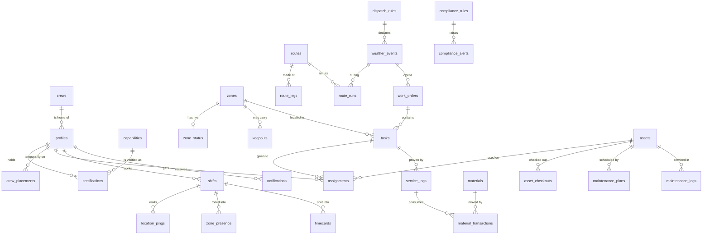

# UND Grounds Operations Platform, technical blueprint v0.1

Date: September 6, 2026
For: Mason, Chad, Bobby, and whoever builds alongside Claude and ChatGPT
Scope: the shared, multi-user system that grows out of the current map. Landscaping operations in summer, snow and ice operations in winter, one codebase, one database, one switch.

This is a build plan, not a wish list. Everything in it is sized for a crew of 10 to 20 people, a free Supabase project, and two AI assistants doing most of the coding. Where a choice is made, the reason is next to it.

## 0. What already exists and what this adds

Exists today (repo `und-grounds-map`): a single-file Leaflet map with GeoJSON layers (boundary, parcels from the city, mowing areas, snow routes, assets), inline editing, a local save server for iPad tracing, per-device work tracking. No accounts, no sync, no notifications.

This blueprint adds a shared service behind that map. The map stays the front end. The GeoJSON files stay the seed and the offline fallback. The rules in `AGENTS.md` still apply: plain JS, no framework, no build step in the browser.

## 1. System architecture

Three layers, all managed services, no servers to patch.

**Frontend: one Progressive Web App (PWA).** The current `index.html` grows into an app shell with routes: Map, My Day, Dispatch, Assets, Materials, Logs, Reports, Admin. Installs to the phone home screen from a link. Works offline for reading and queues writes until it has signal (campus has coverage, but a machine cab in a storm does not always). Vanilla JS with small modules, Leaflet for the map, a service worker for offline. No React, no bundler, so both assistants can edit any file directly and the crew can open it from a double-click.

**Backend: Supabase.** Postgres with PostGIS for geometry, Row Level Security (RLS) for who sees what, Realtime for live dispatch and crew locations, Storage for photos, Edge Functions (Deno) for the weather trigger engine, push notifications, and report generation, Auth for logins (email and password to start; UND single sign-on later through SAML if UIT allows). Free tier covers this crew comfortably. The whole schema lives in `supabase/migrations/*.sql` in the repo, so the database is versioned with the code.

**Integrations, all free:**
- Basemaps: Esri World Imagery and OpenStreetMap tiles (already in use).
- Weather: National Weather Service API (api.weather.gov) for forecast and alerts at the campus point, plus the NWS Grand Forks office products. Hourly poll by an Edge Function. No paid weather API needed to start.
- Push: Web Push (VAPID keys) from an Edge Function to the PWA. Works on iPhone since iOS 16.4 when the app is installed to the home screen.
- Campus data: City of Grand Forks ArcGIS open data for parcels, roads, and building footprints (already wired). UND's own ArcGIS, if Facilities has one, would plug into the same loader.
- My UND app: a read-only public status page (snow clearing status) hosted from the same project, embedded as a Modo module.

**Why not a native app.** Two app stores, two codebases, UND procurement, and Apple review for every change. A PWA gets GPS, camera, push, and offline in one codebase that two AIs can maintain. If a native wrapper is ever wanted, Capacitor wraps the same code.

### Request flow

```
Phone / laptop PWA
   |  HTTPS (Supabase client, JWT)
   v
Supabase Auth --> Postgres + PostGIS (RLS enforced per row)
   |                  ^
   |                  | triggers write audit rows, hash-chain service logs
   v                  |
Realtime (websocket) ---> live crew positions, dispatch queue, zone status
Storage --------------> before/after photos, signed URLs, 10 year retention
Edge Functions -------> weather poll + trigger matrix, web push, PDF reports, nightly compliance checks
```

## 2. The seasonal pivot

One row, one switch, everything else follows from it.

```sql
create table system_mode (
  id            int primary key default 1 check (id = 1),
  mode          text not null check (mode in ('landscaping','snow')),
  changed_by    uuid references profiles(id),
  changed_at    timestamptz not null default now(),
  note          text
);
```

Flipping `mode` (admin only, one tap in Admin, or automatically by the trigger engine when a winter event is declared) does five things:

1. **UI theme and navigation.** The PWA subscribes to `system_mode` over Realtime. Snow mode swaps the header color to a cold palette, reorders the nav (Dispatch and Routes first, Mowing hidden), and changes the My Day card layout from "areas to mow and beds to check" to "route, machine, attachment, material load, segments remaining."
2. **Active map overlays.** Every zone carries two priority values (`priority_landscaping`, `priority_snow`) and two visibility flags. The map reads the one for the current mode. Mowing areas dim in snow mode; snow segments dim in landscaping mode. Same polygons, different meaning.
3. **Dispatch queue.** Work orders carry a `season` tag (`landscaping`, `snow`, `either`). The Dispatch screen filters to the current mode plus `either`. Snow mode also enables the trigger matrix.
4. **Task templates and checklists.** Landscaping mode offers mow, trim, bed check, tree inspection, irrigation check, master plan project, site inspection. Snow mode offers plow, shovel, salt, sand, brine, haul, storage corner, hydrant clear.
5. **Mobile home screen.** My Day renders from the mode: in snow mode the first card is always "your route and machine" with a Start Route button; in landscaping mode it is the first task by priority.

Nothing is deleted or archived on a flip. Winter data is visible from summer through Reports. The flip is logged.

## 3. GIS zones and priority tiers

Everything on the ground is a `zone` with a PostGIS geometry. The current GeoJSON layers load into this table as the seed; the map keeps drawing from GeoJSON when offline.

Zone classes (the `class` column): `campus_boundary`, `mowing_area`, `bed`, `tree_stand`, `priority_road`, `commuter_lot`, `service_drive`, `pedestrian_plaza`, `walkway`, `ada_walkway` (hand shoveled, never skipped), `stair`, `ramp`, `building_entry`, `hydrant`, `salt_box`, `snow_storage`, `keep_out`, `sprayed`, `hazard`, `utility_valve`, `water_main`, `irrigation_head`, `sprinkler_zone`.

Priority tiers are per mode. `priority_snow` uses the four tiers already in the snow standard draft (T1 life safety and accessibility, open by 6:30 a.m.; T2 primary circulation, 7:30 a.m.; T3 full service, noon next day; T4 cleanup and haul, by request). `priority_landscaping` uses three (P1 front door and event lawns, P2 general campus, P3 perimeter and low traffic). Colors are fixed per tier and shared by both modes so the crew learns one legend: red, orange, blue, gray.

Geofencing: PostGIS `ST_Contains(zone.geom, point)` with a tolerance buffer per class (`geofence_buffer_m`, default 10 m for lots, 5 m for walks) so a phone standing on the curb still counts.

Drawing: the existing Edit mode. Save writes the polygon to `zones` through the Supabase client when online, or to `data/*.geojson` through the local server when offline, and a sync job reconciles by stable `id`. The city's parcels stay a separate read-only table refreshed by `tools/fetch_parcels.py`.

## 4. Database schema

Postgres with PostGIS. Every table has `id uuid default gen_random_uuid()`, `created_at`, `updated_at`, and RLS. Tables marked **append-only** have UPDATE and DELETE revoked from every role except a service role that never runs from the app.

### 4.1 People and access

```sql
create table profiles (            -- one per Supabase auth user
  id uuid primary key references auth.users(id),
  full_name text not null,
  phone text,
  employment_tier text not null check (employment_tier in ('admin','full_time','temp2','temp1','oversight')),
  app_role text not null check (app_role in ('oversight','admin','lead','worker')),
  reports_to uuid references profiles(id),
  crew_id uuid references crews(id),
  is_student boolean not null default false,   -- drives the hour cap rule
  active boolean not null default true
);

create table crews (
  id uuid primary key, name text not null,          -- Zone A, Mow crew, Flower crew, Snow lots 1
  crew_type text not null check (crew_type in ('zone','mow','flower','snow_lots','snow_walks','tree','irrigation')),
  lead_id uuid references profiles(id),
  home_zone_ids uuid[]                               -- zones this crew normally covers
);

create table crew_placements (                      -- temporary coverage, effective dated
  id uuid primary key, profile_id uuid references profiles(id), crew_id uuid references crews(id),
  starts_at timestamptz not null, ends_at timestamptz, placed_by uuid references profiles(id), reason text
);

create table capabilities (                         -- the master list Chad and Bobby own
  id uuid primary key, code text unique not null,   -- TOOLCAT, MOWER_4100, BOBCAT, PLOW_TRUCK, CHAINSAW, AERIAL_LIFT, PESTICIDE, CDL, SALT_SPREADER
  name text not null, category text not null,       -- equipment, tool, license, safety
  granted_by_tier text not null check (granted_by_tier in ('admin','full_time'))  -- who may verify it
);

create table certifications (                       -- a person holding a capability
  id uuid primary key, profile_id uuid references profiles(id), capability_id uuid references capabilities(id),
  verified_by uuid references profiles(id), verified_at timestamptz not null,
  expires_at timestamptz, suspended boolean not null default false, restrictions text,
  unique (profile_id, capability_id)
);
```

### 4.2 Ground

```sql
create table zones (
  id text primary key,                                -- stable, e.g. MOW-03, LOT-REA, ADA-12 (matches GeoJSON ids)
  name text not null,
  class text not null,                                -- see section 3
  site text not null default 'main',
  geom geometry(Geometry, 4326) not null,
  priority_landscaping smallint check (priority_landscaping between 1 and 3),
  priority_snow smallint check (priority_snow between 1 and 4),
  visible_landscaping boolean not null default true,
  visible_snow boolean not null default true,
  responsible_crew_id uuid references crews(id),
  owner text,                                         -- Facilities, Housing, Parking, REA, EERC, Athletics, Wellness
  acres numeric, length_m numeric, width_m numeric,
  geofence_buffer_m numeric not null default 8,
  needs_tracing boolean not null default true,
  attrs jsonb not null default '{}'                   -- class-specific fields (mow frequency, plant list, valve type)
);
create index zones_geom_gix on zones using gist (geom);

create table zone_status (                            -- live state per zone per mode, one row per zone
  zone_id text primary key references zones(id),
  status text not null default 'not_started',         -- not_started, in_progress, cleared, salted, sanded, done, blocked
  salted boolean not null default false, sanded boolean not null default false,
  updated_by uuid references profiles(id), updated_at timestamptz not null default now(),
  event_id uuid references weather_events(id)         -- which storm this status belongs to
);

create table keepouts (                               -- sprayed areas and temporary hazards, self expiring
  id uuid primary key, zone_id text references zones(id), geom geometry(Polygon,4326),
  kind text not null check (kind in ('sprayed','hazard','closed')),
  product text, applied_by uuid references profiles(id), starts_at timestamptz not null,
  reentry_at timestamptz, closed_by uuid references profiles(id), closed_at timestamptz, photo_path text, notes text
);
```

### 4.3 Assets and materials

```sql
create table assets (
  id text primary key,                                -- EQ-14, ATT-03 (printed on the barcode label)
  name text not null, asset_type text not null check (asset_type in ('machine','attachment','vehicle','tool')),
  class text not null,                                -- mower, loader, skid_steer, tractor, utility_vehicle, truck, plow, pusher_box, broom, blower, spreader, bucket
  make text, model text, year int, serial text,
  required_capability_id uuid references capabilities(id),
  compatible_with text[],                             -- for attachments: asset ids or classes they fit
  status text not null default 'in_service' check (status in ('in_service','down','needs_repair','retired')),
  home_zone_id text references zones(id),
  hour_meter numeric not null default 0,
  barcode text unique,                                -- content of the printed code, defaults to id
  howto_md text                                       -- start-up, quirks, tips, what breaks
);

create table asset_checkouts (
  id uuid primary key, asset_id text references assets(id), profile_id uuid references profiles(id),
  attachment_id text references assets(id),           -- what was mounted
  checked_out_at timestamptz not null default now(), checked_in_at timestamptz,
  hours_out numeric, hours_in numeric,                -- meter readings
  condition_out text, condition_in text, photo_out text, photo_in text, task_id uuid references tasks(id)
);

create table maintenance_plans (
  id uuid primary key, asset_id text references assets(id), name text not null,      -- 50 hr service, blade change, season prep
  every_hours numeric, every_days int, last_done_at timestamptz, last_done_hours numeric, checklist_md text
);

create table maintenance_logs (                       -- append-only
  id uuid primary key, asset_id text references assets(id), plan_id uuid references maintenance_plans(id),
  done_by uuid references profiles(id), done_at timestamptz not null default now(), hours_at numeric,
  work_done text not null, parts text, cost numeric, photo_path text
);

create table materials (
  id uuid primary key, name text not null,            -- bulk salt, sand, liquid brine, fertilizer 24-0-11, mulch, seed
  unit text not null,                                 -- lb, gal, bag, yd3
  on_hand numeric not null default 0, reorder_at numeric not null default 0, storage_zone_id text references zones(id)
);

create table material_transactions (                  -- append-only; on_hand is a running total kept by trigger
  id uuid primary key, material_id uuid references materials(id), qty numeric not null,   -- negative for use
  kind text not null check (kind in ('receive','use','adjust','waste')),
  by_profile uuid references profiles(id), at timestamptz not null default now(),
  service_log_id uuid references service_logs(id), zone_id text references zones(id), note text
);
```

### 4.4 Work

```sql
create table work_orders (
  id uuid primary key, number serial,                 -- WO-2026-0143 for humans
  season text not null check (season in ('landscaping','snow','either')),
  title text not null, description text, source text,  -- email, phone, walk-in, weather trigger, inspection
  requested_by text, priority smallint not null default 2,
  status text not null default 'open' check (status in ('open','in_progress','blocked','done','canceled')),
  created_by uuid references profiles(id), due_at timestamptz, event_id uuid references weather_events(id)
);

create table tasks (
  id uuid primary key, work_order_id uuid references work_orders(id),
  zone_id text references zones(id), point geometry(Point,4326),
  task_type text not null,                            -- mow, trim, bed_check, tree_inspect, plow, shovel, salt, sand, brine, haul, inspect, project
  outcome text not null,                              -- what "done" looks like, one sentence
  required_capability_ids uuid[] not null default '{}',
  required_asset_class text,
  priority smallint not null default 2,
  state text not null default 'unassigned' check (state in ('unassigned','assigned','accepted','in_progress','blocked','review','done','canceled')),
  accountable_id uuid references profiles(id),
  scheduled_start timestamptz, scheduled_end timestamptz,
  evidence_required text[] not null default '{}'      -- photo_before, photo_after, material_qty, geofence
);

create table assignments (
  id uuid primary key, task_id uuid references tasks(id), profile_id uuid references profiles(id),
  asset_id text references assets(id), attachment_id text references assets(id),
  assigned_by uuid references profiles(id), assigned_at timestamptz not null default now(),
  acknowledged_at timestamptz, released_at timestamptz, release_reason text,
  reassigned_from uuid references assignments(id)
);

create table routes (                                 -- snow machine routes and landscaping mow runs
  id text primary key, name text not null, season text not null, machine_class text, attachment_class text,
  tier smallint, window_hours numeric, notes text
);
create table route_legs (
  id uuid primary key, route_id text references routes(id), seq int not null,
  zone_id text references zones(id), action text not null,  -- plow, salt, travel, push_to_corner
  direction text, snow_to text, est_minutes numeric, instructions text,
  unique (route_id, seq)
);
create table route_runs (                             -- one machine running one route in one event
  id uuid primary key, route_id text references routes(id), event_id uuid references weather_events(id),
  profile_id uuid references profiles(id), asset_id text references assets(id), attachment_id text references assets(id),
  started_at timestamptz, finished_at timestamptz, current_leg int not null default 1, taken_over_from uuid references route_runs(id)
);
```

### 4.5 Field truth: shifts, locations, proof of service

```sql
create table shifts (
  id uuid primary key, profile_id uuid references profiles(id),
  started_at timestamptz not null default now(), ended_at timestamptz,
  start_point geometry(Point,4326), end_point geometry(Point,4326), device_id text
);

create table location_pings (                         -- append-only, partitioned by month, 30 day retention for raw pings
  id bigserial primary key, shift_id uuid references shifts(id), profile_id uuid references profiles(id),
  at timestamptz not null, geom geometry(Point,4326) not null, accuracy_m numeric, speed_mps numeric, battery smallint
) partition by range (at);

create table zone_presence (                          -- derived by trigger from pings: entry and exit per zone
  id uuid primary key, shift_id uuid references shifts(id), profile_id uuid references profiles(id),
  zone_id text references zones(id), entered_at timestamptz not null, exited_at timestamptz, task_id uuid references tasks(id)
);

create table service_logs (                           -- append-only, hash chained. The liability record.
  id uuid primary key,
  seq bigserial,                                      -- global order
  task_id uuid references tasks(id), zone_id text not null references zones(id),
  profile_id uuid not null references profiles(id), asset_id text references assets(id), attachment_id text references assets(id),
  action text not null,                               -- plowed, shoveled, salted, sanded, brined, mowed, trimmed, inspected
  started_at timestamptz not null, completed_at timestamptz not null,
  device_time timestamptz not null, server_time timestamptz not null default now(),
  completion_point geometry(Point,4326) not null, gps_accuracy_m numeric not null,
  inside_geofence boolean not null,                   -- computed at insert, never editable
  distance_to_zone_m numeric not null,
  materials jsonb not null default '[]',              -- [{material_id, qty, unit}]
  conditions jsonb not null default '{}',             -- {air_temp_f, surface_temp_f, precip, snow_depth_in} from the event snapshot
  photo_before text, photo_after text,                -- storage paths; the object is immutable too
  notes text,
  prev_hash text not null, row_hash text not null     -- sha256 over the row content plus prev_hash
);
revoke update, delete on service_logs from authenticated, anon;
```

The hash chain: a `before insert` trigger reads the last row's `row_hash`, computes `sha256(prev_hash || canonical json of the new row)`, and stores both. Anyone can recompute the chain and prove no row was changed or removed. Nightly, an Edge Function writes the day's last hash into a `chain_anchors` table and emails it to Chad and to a UND Facilities mailbox, so there is a copy outside the database. Photos are stored with `x-amz-object-lock` style immutability (Supabase Storage bucket with no update or delete policy for app roles). Retention: service logs and photos are kept for at least 10 years, which covers North Dakota's general negligence limitation period with margin. Raw GPS pings are kept 30 days and rolled up into `zone_presence`, which is kept with the logs.

### 4.6 Weather and dispatch automation

```sql
create table weather_observations (                   -- hourly NWS poll for the campus point
  id bigserial primary key, at timestamptz not null, source text not null,
  air_temp_f numeric, dewpoint_f numeric, precip_type text, precip_rate_in_hr numeric, snow_depth_in numeric,
  wind_mph numeric, alerts text[], raw jsonb
);

create table weather_events (                         -- a storm, declared by the engine or by hand
  id uuid primary key, name text not null,            -- "Nov 14 storm"
  declared_at timestamptz not null default now(), declared_by uuid references profiles(id),   -- null when automatic
  ended_at timestamptz, trigger_rule_id uuid references dispatch_rules(id), peak_snow_in numeric, notes text
);

create table dispatch_rules (                         -- the trigger depth matrix
  id uuid primary key, name text not null, active boolean not null default true, season text not null default 'snow',
  condition jsonb not null,      -- {"any":[{"snow_depth_in":{">=":2}},{"precip_type":"freezing_rain"}],"lead_hours":6}
  action jsonb not null,         -- {"callout_group":"full_plow_fleet","set_mode":"snow","create_work_orders_from_routes":["LOT-*","SW-*"],"priority":1}
  cooldown_hours numeric not null default 6
);

create table callout_groups (
  id uuid primary key, code text unique not null,     -- salt_crew, walk_crew, full_plow_fleet, haul_crew
  name text not null, member_ids uuid[] not null, backup_ids uuid[] not null default '{}'
);

create table notifications (                          -- in-app queue is the record; push is a delivery attempt
  id uuid primary key, profile_id uuid references profiles(id), kind text not null,
  title text not null, body text, payload jsonb, created_at timestamptz not null default now(),
  delivered_at timestamptz, acknowledged_at timestamptz, push_attempts int not null default 0
);
```

Example matrix (seed data, editable in Admin):

| Rule | Condition | Action |
|---|---|---|
| Trace and ice | precip_type in (freezing_rain, sleet) or (air_temp_f <= 32 and precip_rate > 0) or NWS ice alert | call out `salt_crew`; create salt tasks on all T1 and T2 walks and entries; set mode snow if not already |
| Light snow | snow_depth_in >= 1 and < 2, or forecast >= 1 in 6 hr | call out `walk_crew`; create T1 walk routes; salt ADA walkways |
| Plow event | snow_depth_in >= 2 or forecast >= 2 in 6 hr | call out `full_plow_fleet`; create all lot and road routes as `route_runs`; open a `weather_event` |
| Haul | storage corners flagged full by two operators | call out `haul_crew` next business day |

The engine runs hourly in an Edge Function: poll NWS, insert an observation, evaluate each active rule against the last 6 hours of observations and the next 12 hours of forecast, respect cooldowns, and on a match write the work orders, route runs, and notifications in one transaction. A human can fire any rule by hand from Dispatch, and any automatic callout shows "auto, rule: Plow event" so nobody wonders where it came from.

### 4.7 Labor and compliance

```sql
create table timecards (                              -- derived from shifts and tasks, then corrected by hand with history
  id uuid primary key, profile_id uuid references profiles(id), shift_id uuid references shifts(id),
  task_id uuid references tasks(id), zone_id text references zones(id), work_order_id uuid references work_orders(id),
  activity text not null check (activity in ('work','travel','break','blocked','training','standby')),
  started_at timestamptz not null, ended_at timestamptz not null,
  minutes int generated always as (extract(epoch from (ended_at - started_at))/60) stored,
  source text not null default 'auto',                 -- auto (from presence), manual, corrected
  corrected_from uuid references timecards(id), corrected_by uuid references profiles(id), correction_reason text
);

create table compliance_rules (
  id uuid primary key, code text unique not null, name text not null, active boolean not null default true,
  applies_to jsonb not null,     -- {"is_student":true,"in_session":true}
  rule jsonb not null,           -- {"max_hours_per_week":20} or {"max_consecutive_hours":14,"min_rest_hours":8}
  severity text not null default 'warn' check (severity in ('info','warn','block')),
  reference text                 -- "UND Student Employment policy 4.x", "OSHA 29 CFR 1910.xxx"
);

create table compliance_alerts (
  id uuid primary key, rule_id uuid references compliance_rules(id), profile_id uuid references profiles(id),
  period_start date, period_end date, observed numeric, limit_value numeric,
  raised_at timestamptz not null default now(), acknowledged_by uuid references profiles(id), acknowledged_at timestamptz
);

create table academic_calendar (                      -- drives "in session" for the student hour cap
  id uuid primary key, term text not null, starts_on date not null, ends_on date not null, in_session boolean not null
);
```

Seed rules: student workers capped at 20 hours per week while classes are in session (confirm the exact UND number with HR; the value is data, not code), 40 hours per week in breaks, a soft warning at 12 consecutive hours during a storm and a block at 16, minimum 8 hours between shifts unless an admin overrides with a reason, annual safety training expiry as a capability with `expires_at`. Cost accounting: `timecards` joined to `zones` and `work_orders` gives minutes per zone, per task type, per work order, per crew, per week. Export to CSV for Facilities' cost model; no billing module.

### 4.8 ERD



### 4.9 Row Level Security in one paragraph

Every table has policies keyed on `auth.uid()` and the caller's `app_role`. Oversight reads aggregate views only (no `location_pings`, no per-person timecards). Admin reads and writes everything except append-only tables, which nobody updates. Leads read their crew's rows (`profiles.crew_id` or an active `crew_placements` row) and other leads' task lists, and can insert `assignments` only for people in their crew. Workers read their own rows plus any zone, route, asset, keepout, and notification addressed to them, and can insert their own `shifts`, `location_pings`, `service_logs`, `asset_checkouts`. A worker can never read another worker's pings or timecards. This is enforced in Postgres, so a bug in the page cannot leak it.

## 5. Modular software architecture

Folders in the repo after phase 1:

```
index.html                 app shell (map stays the first screen)
app/
  core/    auth.js, db.js (Supabase client), mode.js (season switch), sync.js (offline queue), push.js, geo.js (PostGIS helpers, geofence math client side for instant feedback)
  map/     layers.js, edit.js, legend.js, mask.js             (today's map code, split up)
  myday/   myday.js, task-card.js, route-run.js               (worker home, snow route guidance)
  dispatch/ queue.js, assign.js, reassign.js, callout.js, matrix.js
  assets/  scan.js (barcode via BarcodeDetector API, fallback to a QR library), checkout.js, maintenance.js, howto.js
  materials/ inventory.js, apply.js
  logs/    service-log.js (the proof-of-service form), photos.js, verify-chain.js
  reports/ zone-time.js, cost.js, proof-of-service-pdf.js, compliance.js
  admin/   people.js, certs.js, zones.js, rules.js, calendar.js, mode-switch.js
sw.js                      service worker: cache shell, queue writes, background sync
supabase/
  migrations/*.sql         schema, RLS, triggers (hash chain, presence rollup, inventory totals)
  functions/weather-poll/  hourly NWS poll and rule engine
  functions/push/          web push sender
  functions/report-pdf/    proof-of-service and cost reports
  functions/nightly/       compliance checks, chain anchor, retention
  seed/                    zones from data/*.geojson, capabilities, rules, calendar
data/                      GeoJSON stays: seed, offline fallback, and the iPad tracing path
tools/                     build.py, serve.py, fetch_parcels.py, seed_supabase.py
docs/                      this file, the spec, the product brief, the data schema
```

Each module is a plain ES module with one job and no framework. Both assistants can work in different folders without collisions. Shared rules stay in `AGENTS.md`.

## 6. The proof-of-service form (the one screen that matters most)

When a worker taps Done on a task with `evidence_required`, the app:

1. Reads GPS with high accuracy and refuses to continue until accuracy is under 25 m (shows a countdown, tells them to step outside the cab if needed).
2. Computes distance to the zone polygon on the phone and shows it. If outside the geofence it still allows the log but flags it, and the flag can never be removed. Chad sees flagged logs in a list.
3. Requires the after photo. Requires the before photo if the task said so (default yes for snow). Photos are taken in-app, stamped with time and coordinates in EXIF and in the database row, uploaded to an immutable bucket.
4. Asks for material quantities with the units the crew uses: pounds of salt from the spreader setting and distance (a lookup table per spreader), gallons of brine, bags of fertilizer.
5. Snapshots the current weather observation into the row.
6. Inserts the `service_logs` row (or queues it offline with the device time, and the server time is set on arrival; both are kept).

The forensic report is one Edge Function: give it a zone and a date range and it returns a PDF with the map, every log in order with photos, materials, conditions, who, what machine, GPS proof, the hash chain segment, and a statement of how the chain is anchored. This is what goes to UND legal after a slip-and-fall claim.

## 7. Development roadmap

Each phase ships something the crew uses. No phase depends on hardware, procurement, or UIT.

**Phase 0 (done): the map.** Layers, editing, parcels, boundary, iPad tracing.

**Phase 1, MVP, 4 to 6 weeks: shared accounts, mobile tracking, proof of service.**
1. Supabase project, migrations for `profiles`, `crews`, `capabilities`, `certifications`, `zones`, `zone_status`, `assets`, `shifts`, `location_pings`, `zone_presence`, `service_logs` with hash chain, `notifications`, `system_mode`. RLS from day one.
2. Seed zones from `data/*.geojson`, assets from the equipment list, people from a CSV Chad fills in.
3. PWA shell: login, install prompt, My Day (read-only list of tasks entered by hand in Admin), Map (existing), Start Shift and End Shift with GPS pings every 30 seconds while on shift, Done button with the proof-of-service form, offline queue.
4. Admin: people, certs, zones (existing editor writing to the database), assets, manual work order and task entry, assign by picking from certified and available people.
5. Push notifications on assignment. In-app queue is the record.
6. Pilot: one crew, one zone group, one week baseline of "how many times did someone walk back to the shop to ask what to do," then four weeks on the app.

**Phase 2, 3 to 4 weeks: dispatch and assets.** Reassign with displaced-work preview, crew tree, availability by certification, barcode scan check-out and check-in with attachment, hour meter and maintenance plans with due alerts, materials with running totals and reorder alerts, keep-out and hazard reports with photo routing, timecards from presence with correction history, student hour cap rule.

**Phase 3, before first snow: the pivot and the matrix.** `system_mode` switch and UI theme, dual priorities on zones, snow route legs loaded from the redesign, route runs with step guidance and takeover, live zone status (cleared, salted, sanded) from the machine, NWS poll and dispatch rules with call-out groups, storm dashboard for Chad, public snow status page for My UND.

**Phase 4, spring: reports and knowledge.** Proof-of-service PDF, cost per zone and work order, compliance report, campus knowledge layers (valves, mains, irrigation heads, beds with plant lists), UAS orthophoto as a basemap option, Ecopia or self-segmented land cover if it is worth paying for.

**Phase 5, when asked: identity and scale.** UND SSO through SAML, hosting on a UND domain, second department (custodial or Parking) on the same schema with their own crews and zones.

## 8. Risks and how they are handled

- **GPS drains phones.** Pings only while on shift, 30 second interval, coarse when stationary, the app says so on the shift screen. Cab chargers for the machines.
- **No signal in a storm.** Offline queue with device time; server time recorded on arrival; both shown on the log. The route steps are cached when the run starts.
- **Someone marks work done from the shop.** The geofence flag cannot be cleared, and Chad's dashboard lists every flagged log.
- **The tracking conversation.** Written rule before rollout (already in the spec), workers see their own trail, oversight sees totals only, raw pings deleted after 30 days.
- **Two AIs edit the same file.** Folder ownership per task in the commit message, pull before start, migrations are numbered and never edited after they run.
- **Free tier limits.** Supabase free covers 500 MB database and 1 GB storage; photos at 1600 px are about 300 KB, so roughly 3,000 photos before the first paid tier ($25 a month). Plan for it in year two.
- **The hash chain is only as good as its anchor.** Nightly anchor emailed outside the system. That is the part to explain to legal.

## 9. What to confirm before phase 1 starts

1. The reporting tree and Bobby's scope (from the product brief).
2. The exact student hour cap and the source policy.
3. Which spreaders are on which units and their pounds-per-mile settings, so material quantities are real.
4. Whether Facilities has an ArcGIS account with campus layers we can load instead of tracing.
5. Who at UND legal or risk management wants the proof-of-service report format reviewed.
